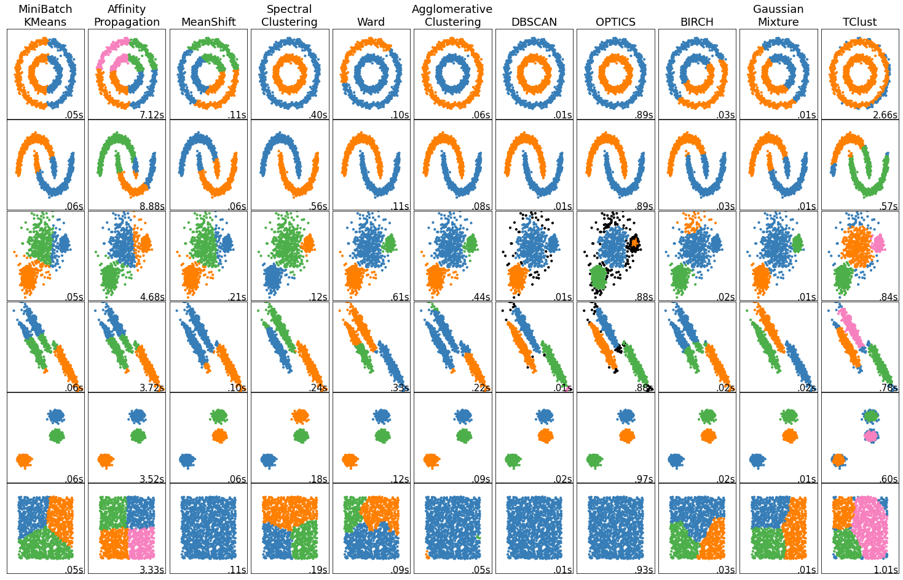

Quickstart
============

Installation
------------

The easiest and fastest way to use this package is by downloading it and importing it in your own code (see examples below).

.. code-block:: bash

    $ git clone https://github.com/albanda/tclust.git

Soon, you will be able to install it through `pip` (**NOTE** this option is not available yet):

.. code-block:: bash

    $ pip install tclust

.. _examples:

Getting started
---------------

As in any sklearn estimator, a typical `tclust` analysis consists of 3 steps:

1. Instantiate the class.
2. Fit the TClust estimator to your data.
3. You can choose to visualize the output and evaluate your results.

.. code-block:: python

        from tclust import TClust
        model = TClust(k=3)
        model.fit(X)
        print(model.labels_)

The examples below show some basic analysis that can be carried out with `tclust`.

Example 1: Running mixture model
+++++++++++++++++++++++++++++++++++++

In `examples/x.csv` we provide the dataset for this example.
You can follow these instructions to test `tclust`:

.. code-block:: python

    from tclust import TClust
    import pandas as pd  # to load the data, stored in a csv file
    import matplotlib.pyplot as plt
    from sklearn.metrics import confusion_matrix

    x = pd.read_csv('x.csv', header=None).values
    y = [0] * nsamp + [1] * nsamp + [2] * nsamp + [3] * nsamp

    clustering = TClust(k=3, alpha=0.25, n_inits=200, ksteps=40, equal_weights=False, restr_cov_value='deter',
                        maxfact_e=1e10, maxfact_d=10, m=1.1, zero_tol=1e-16, trace=0, opt='mixture', sol_ini=None,
                        tk=False)
    clustering.fit(x)
    print(set(clustering.best_iter.labels_))
    print(confusion_matrix(label, clustering.best_iter.labels_))
    plt.subplot(1, 2, 1)
    plt.scatter(x[:, 0], x[:, 1], c=y)  # color defined by the original label
    plt.xlabel("Feature 1")
    plt.xlabel("Feature 2")
    plt.title('Ground truth')
    plt.scatter(x[:, 0], x[:, 1], c=clustering.best_iter.labels_)  # color defined by tclust
    plt.xlabel("Feature 1")
    plt.xlabel("Feature 2")
    plt.title('Ground truth')
    plt.show()

You can look at the plot of the results in the `examples/tclust.ipynb` notebook.

Example 2: Comparison with existing clustering methods in scikit-learn
+++++++++++++++++++++++++++++++++++++++++++++++++++++++++++++++++++++++

The figure below shows a comparison of the vanilla version of `tclust` (i.e., using default parameters) with
existing clustering models in scikit-learn. The code to generate the plot is in `examples/plot_cluster_comparison_sklearn.ipynb`.

